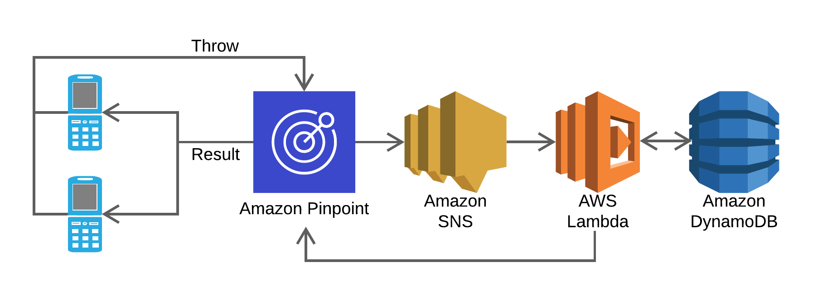
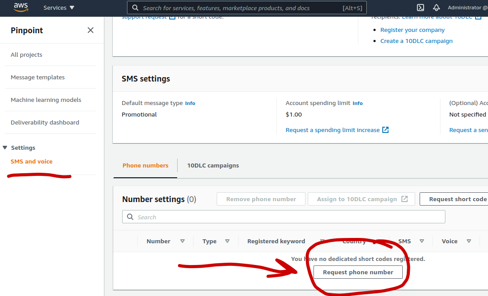
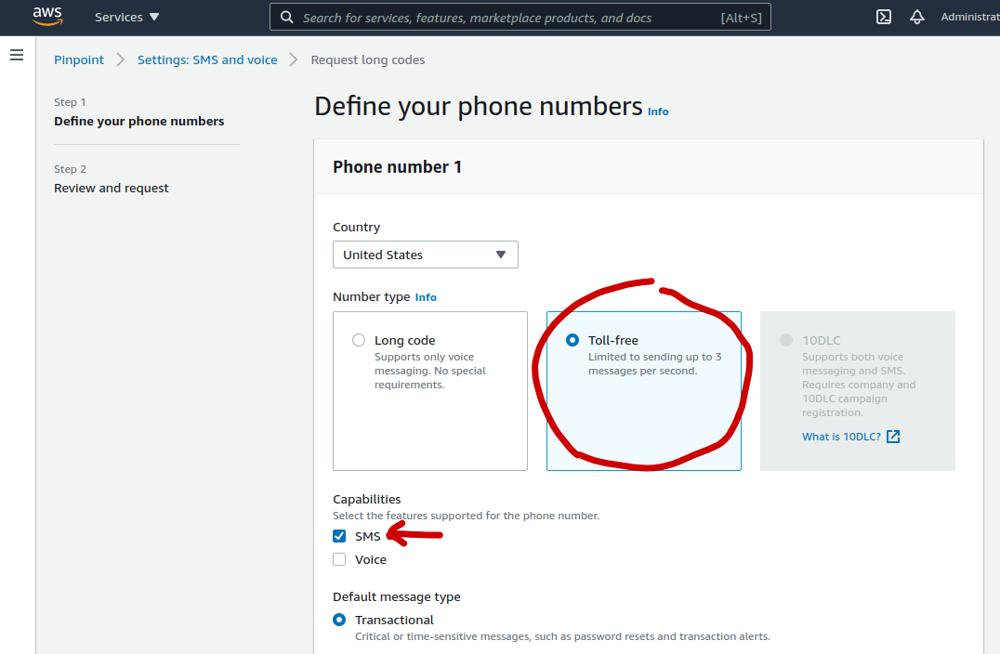
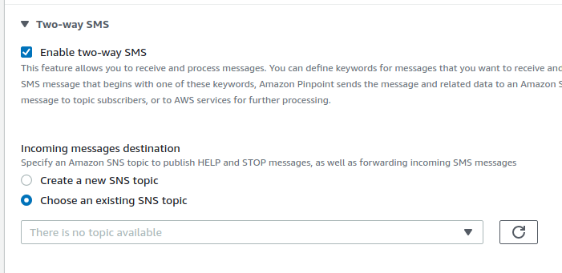

<p align="center">
    
</p>

<h1  align="center">
  Rock Paper Scissors
</h1>

<h3 align="center">
  A <em> mostly </em> one-click-deploy serverless implementation.
</h3>

<p align="center">
   
</p>


This repository contains the code and configurations to deploy a small set of AWS services used to play rock paper scissors via SMS. Any two players can text the Amazon Pinpoint number a number of set commands to play rock-paper-scissors with a friend. The pinpoint access point sends incoming messages to a Simple Notification Service topic, which triggers a Lambda function to process the game logic. The Lambda function uses DynamoDB to store state such as players and their throws. The Lambda function sends an SMS back to the original players notifying them of their result. 
# Environment 

## AWS Credentials

Running this code requires you to have an AWS account and to have your AWS credentials configured on the machine you are using to run this code. If you already have AWS credentials set up you can skip this section.

If you do not have an account you can sign up for one here: https://aws.amazon.com/. It is recommended that you do not use you root credentials but rather [create a separate IAM user role](https://docs.aws.amazon.com/IAM/latest/UserGuide/best-practices.html#create-iam-users) for yourself (This is similar to root vs user on a personal computer). 

Once you have your credentials (access key id and secret access key) you will need to store them locally. The easiest way to do this is using the [AWS Command Line Interface](https://aws.amazon.com/cli/) command `aws configure` . You can find helpful instructions [here](https://docs.aws.amazon.com/cli/latest/userguide/cli-configure-quickstart.html). 

Otherwise you will have to configure your credentials by hand by editing or creating the following file
* `~/.aws/credentials` on macOS or Linux
* `C:\Users\YOUR_USERNAME\.aws\credentials` on Windows. 

Your credentials should have the following format:
```
[default]
aws_access_key_id = YOUR_ACCESS_KEY_ID
aws_secret_access_key = YOUR_SECRET_ACCESS_KEY
```
If configuring by hand you will also need to follow a similar process to set up your region, which lives in the file

* `~/.aws/config` on macOS or Linux
* `C:\Users\YOUR_USERNAME\.aws\config` on Windows. 

Which should look like 
```
[default]
region=us-east-1
output=text
```
## Python Dependencies
This project uses `python3.8` and the [AWS SDK for Python](https://aws.amazon.com/sdk-for-python/), Boto3. 
```
pip install boto3
```
# Deployment

There are two steps to deployment:

## 1. Deploy via Python Script
To deploy the game you will need to run the setup file. 
```
python setup.py
```
This will automatically deploy all of the services and their required permission configurations, besides requesting a phone number. The script will pause once deployed and wait for input. Pressing enter will tear down the deployed services. Edit the `TEARDOWN` boolean in `setup.py` to keep services alive. 
## 2. Request A Phone Number
This game is played via SMS, so you'll need an AWS phone number to send text messages to. 

Sign-in to the AWS console and navigte to the Pinpoint Service. From there, navigate to `Settings > SMS and Voice`. Here you will see a page where, at the bottom, you can request a phone number to be associated with your AWS account.

**You must request a Toll-free number to enable SMS capabilities.**

<p align="center">
   
</p>

<p align="center">
   
</p>


This will cost about one or two dollars per month. You can configure your projects to limit the total amount you are willing to spend on SMS messages. 

Once you have a phone number you must turn on Two-way SMS. This setting can be accessed by clicking on your new phone number and scrolling to the bottom of the page and clicking "**Two-way SMS**". Here you must select your inbound SNS topic to send all incoming text messages to. 

<p align="center">
   
</p>


# Usage

Send a text `test` to your new phone number while the `setup.py` script is running (paused before teardown). 

Gameplay is simple: text `rock`, `paper`, or `scissors` to your new pinpoint phone number and get a friend to do the same to find out who won. 

You can also text the number twice to find out which one of your selves won. 

# Implementation Details

## Mutex Locking

Lambda functions are invoked on a per-SMS basis and operate asynchronously. When an SMS is received, the invoked lambda function will check a DynamoDB table for an existing game throw from another player. The lambda code contains a rudimentary lock implementation to provide mutual exclusion to the game state table. A DynamoDB table stores named locks and uses conditional expressions to atomically acquire locks. 

The locks have an expiration time parameter to prevent deadlocking from process failure while holding the lock. Lambda functions must acquire a lock before editing or reading the game state table. They cannot acquire the lock while another function is accessing the table, and must wait for its release. 

From a practical standpoint, this locking scheme is sufficient for the given purpose given that the processes are short lived and require a lock on a single resource. 

Locking methods are all implemented in the lambda handler file to simplify importing of libraries or additional files. 

Locking implementation adapted from 
https://blog.revolve.team/2020/09/08/implement-mutex-with-dynamodb/
and https://github.com/chiradeep/dyndb-mutex